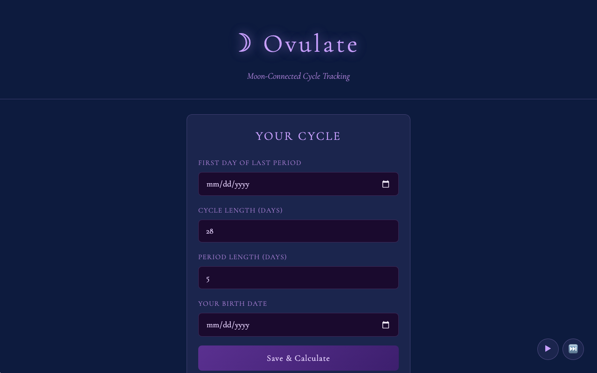

# Moon Cycle Tracker

A moon-phase cycle tracking app that combines standard menstrual cycle predictions with lunar fertility tracking. Enter the first day of your last period, your cycle length, period length, and optionally your birth date. The app calculates your fertile window, ovulation date, next period, and — if you provide your birth date — your natal lunar return (the day each month when the Moon returns to the phase it held when you were born, a traditional fertility high point). A 6-month outlook shows upcoming cycles with potential due dates and zodiac signs. An embedded ambient music player adds to the experience.



**All data stays in your browser's localStorage. Nothing is sent to any server.**

## Features

- Menstrual cycle timeline with color-coded phases (period, follicular, fertile window, luteal)
- Moon phase markers on each day of the cycle bar
- Natal lunar return calculation and highlighting (requires birth date)
- Predictions panel: cycle day, ovulation date, fertile window, next period
- Estimated due date with Naegele's Rule and zodiac sign of a child conceived that cycle
- Holiday proximity warning near the estimated due date
- 6-month outlook with per-cycle timelines, fertile windows, and due dates
- Planetary events overlay: solstices, equinoxes, solar/lunar eclipses, meteor showers, Mercury/Venus/Mars retrogrades
- Ambient YouTube music player (play/pause/skip)
- Fully responsive; works on mobile

## Prerequisites

- Node 18+ (only needed for local dev with Wrangler)
- A Cloudflare account and `npx wrangler login` (only needed for Cloudflare Pages deployment)

## Deploy to Cloudflare Pages

This is a static site — no database, no secrets, no backend required.

```bash
# 1. Create a Pages project (first deploy only)
npx wrangler pages project create moon-cycle-tracker

# 2. Deploy
npx wrangler pages deploy
```

After the first deploy, Cloudflare Pages gives you a `*.pages.dev` URL. You can also connect your GitHub repo in the Cloudflare dashboard for automatic deployments on every push.

## Deploy to any static host

Because this tool has no backend, it works on **any static hosting service** — GitHub Pages, Netlify, Vercel, S3, etc. Just serve the contents of the `public/` directory as the site root.

Example with GitHub Pages:
1. Push this repo to GitHub.
2. In the repo settings, enable GitHub Pages and set the source to the `public/` folder (or use a deploy action).

## Local Development

```bash
# Serve locally with Wrangler's dev server (mirrors Cloudflare Pages behavior)
npx wrangler pages dev
```

The app opens at `http://localhost:8788` by default. No environment variables or secrets are needed.

## License

MIT — see [LICENSE](LICENSE).
